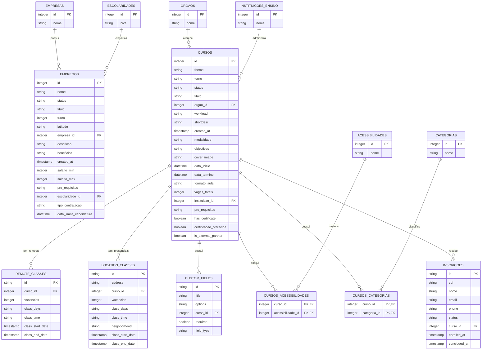

```mermaid
erDiagram
    %% Diagrama simplificado focado nas entidades de negócio
    EMPREGOS {
        integer id PK
        string nome
        string status
        string titulo
        integer turno
        string latitude
        integer empresa_id FK
        string descricao
        string beneficios
        timestamp created_at
        integer salario_min
        integer salario_max
        string pre_requisitos
        integer escolaridade_id FK
        string tipo_contratacao
        datetime data_limite_candidatura
    }

    EMPRESAS {
        integer id PK
        string nome
    }

    CURSOS {
        integer id PK
        string theme
        string turno
        string status
        string titulo
        integer orgao_id FK
        string workload
        string shortdesc
        timestamp created_at
        string modalidade
        string objectives
        string cover_image
        datetime data_inicio
        datetime data_termino
        string formato_aula
        integer vagas_totais
        integer instituicao_id FK
        string pre_requisitos
        boolean has_certificate
        boolean certificacao_oferecida
        boolean is_external_partner
    }

    INSCRICOES {
        string id PK
        string cpf
        string nome
        string email
        string phone
        string status
        integer curso_id FK
        timestamp enrolled_at
        timestamp concluded_at
    }

    CATEGORIAS {
        integer id PK
        string nome
    }

    ACESSIBILIDADES {
        integer id PK
        string nome
    }

    ESCOLARIDADES {
        integer id PK
        string nivel
    }

    INSTITUICOES_ENSINO {
        integer id PK
        string nome
    }

    ORGAOS {
        integer id PK
        string nome
    }

    CUSTOM_FIELDS {
        string id PK
        string title
        string options
        integer curso_id FK
        boolean required
        string field_type
    }

    LOCATION_CLASSES {
        string id PK
        string address
        integer curso_id FK
        integer vacancies
        string class_days
        string class_time
        string neighborhood
        timestamp class_start_date
        timestamp class_end_date
    }

    REMOTE_CLASSES {
        string id PK
        integer curso_id FK
        integer vacancies
        string class_days
        string class_time
        timestamp class_start_date
        timestamp class_end_date
    }

    %% Tabelas de relacionamento N:M
    CURSOS_CATEGORIAS {
        integer curso_id PK, FK
        integer categoria_id PK, FK
    }

    CURSOS_ACESSIBILIDADES {
        integer curso_id PK, FK
        integer acessibilidade_id PK, FK
    }

    %% Relacionamentos
    EMPRESAS ||--o{ EMPREGOS : "possui"
    CURSOS ||--o{ INSCRICOES : "recebe"
    ESCOLARIDADES ||--o{ EMPREGOS : "classifica"
    
    %% Relacionamentos N:M
    CURSOS ||--o{ CURSOS_CATEGORIAS : "possui"
    CATEGORIAS ||--o{ CURSOS_CATEGORIAS : "classifica"
    
    CURSOS ||--o{ CURSOS_ACESSIBILIDADES : "possui"
    ACESSIBILIDADES ||--o{ CURSOS_ACESSIBILIDADES : "oferece"
    
    %% Outros relacionamentos
    ORGAOS ||--o{ CURSOS : "oferece"
    INSTITUICOES_ENSINO ||--o{ CURSOS : "administra"
    CURSOS ||--o{ CUSTOM_FIELDS : "possui"
    CURSOS ||--o{ LOCATION_CLASSES : "tem_presenciais"
    CURSOS ||--o{ REMOTE_CLASSES : "tem_remotas"
```