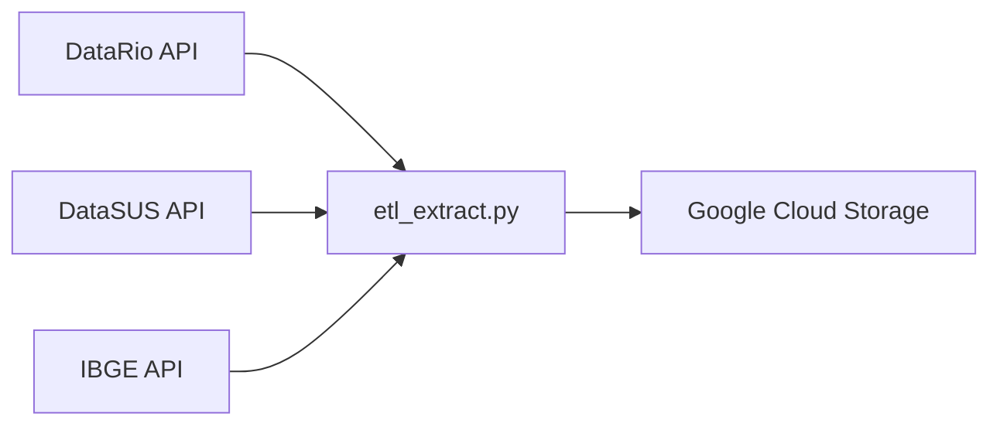

# 🏗️ Guia de Arquitetura - Pipeline Saúde RJ

## Visão Geral da Arquitetura

O Pipeline Saúde RJ implementa uma arquitetura moderna de dados baseada em cloud, seguindo as melhores práticas de Data Engineering com separação clara de responsabilidades.

## Componentes da Arquitetura

### 1. Camada de Extração (Extract Layer)

**Responsabilidade**: Coleta de dados de fontes externas



**Tecnologias**:
- Python 3.9+ com requests
- Pandas para manipulação de dados
- Google Cloud Storage SDK

**Padrões Implementados**:
- Retry com backoff exponencial
- Logging estruturado
- Validação de schema
- Tratamento de erros gracioso

### 2. Camada de Armazenamento (Storage Layer)

**Data Lake**: Google Cloud Storage
- Bucket: `data-saude-brutos`
- Estrutura: `raw/YYYY/MM/DD/dataset.parquet`
- Formato: Parquet (otimizado para analytics)

**Data Warehouse**: BigQuery
- Dataset Raw: `brutos_saude`
- Dataset Processado: `model_saude`
- Particionamento por data de extração

### 3. Camada de Transformação (Transform Layer)

**dbt (Data Build Tool)**

```
models/
├── stg/           # Staging - Limpeza e Tipagem
├── core/          # Core - Métricas e Agregações  
└── marts/         # Marts - Tabelas para Consumo
```

**Estratégia de Materialização**:
- **Staging**: Views (transformações leves)
- **Core**: Tables (agregações complexas)
- **Marts**: Tables (otimizadas para BI)

### 4. Camada de Orquestração (Orchestration Layer)

**Apache Airflow**

```python
DAG: pipeline_saude_rj
├── check_prerequisites
├── extract_health_data  
├── sensor_check_files
├── load_to_bigquery
├── run_dbt_models
├── run_quality_tests
└── send_notifications
```

**Características**:
- Schedule: Diário às 6:00 AM
- Retry: 2 tentativas com delay de 5min
- SLA: 2 horas máximo
- Alertas por email em falhas

### 5. Camada de Qualidade (Quality Layer)

**Great Expectations**
- Validação de schema
- Testes de integridade referencial
- Verificação de completude
- Alertas de anomalias

**Testes dbt**
- Unique constraints
- Not null validations
- Accepted values
- Range validations

## Fluxo de Dados Detalhado

### Fluxo Principal (Happy Path)

1. **06:00** - Airflow inicia DAG
2. **06:05** - Extração das APIs
   - DataRio: Unidades e atendimentos
   - DataSUS: Estatísticas complementares
   - IBGE: Dados demográficos
3. **06:15** - Upload para GCS em formato parquet
4. **06:20** - Sensor verifica arquivos criados
5. **06:25** - Load para BigQuery (tabelas raw)
6. **06:30** - dbt executa transformações
   - Staging: Limpeza e tipagem
   - Core: Métricas e agregações
   - Marts: Tabela final do dashboard
7. **06:45** - Testes de qualidade
8. **06:50** - Atualização de estatísticas BQ
9. **06:55** - Notificação de sucesso

### Tratamento de Erros

**Estratégias de Recuperação**:
- Retry automático (2x)
- Fallback para dados do dia anterior
- Alertas imediatos para time de dados
- Rollback de transformações em caso de falha

**Monitoramento**:
- Logs centralizados no Google Cloud Logging
- Métricas de performance no Airflow
- Alertas proativos via email/Slack

## Padrões de Design Implementados

### 1. ELT (Extract, Load, Transform)

Optamos por ELT ao invés de ETL tradicional:
- **Vantagem**: Flexibilidade para mudanças
- **Benefício**: Poder computacional do BigQuery
- **Resultado**: Transformações mais rápidas

### 2. Medallion Architecture (Bronze, Silver, Gold)

```
Bronze (Raw)     → Silver (Core)    → Gold (Marts)
brutos_saude.*   → model_saude.*    → dashboards
```

### 3. Idempotência

Todas as operações são idempotentes:
- Mesma execução = mesmo resultado
- Permite re-execução segura
- Facilita debugging e recuperação

### 4. Schema Evolution

**Backward Compatibility**:
- Adição de colunas opcionais
- Renomeação com aliases
- Deprecação gradual

## Otimizações de Performance

### BigQuery

**Particionamento**:
```sql
PARTITION BY DATE(data_extracao)
```

**Clustering**:
```sql  
CLUSTER BY regiao, tipo_unidade
```

**Materialização Inteligente**:
- Views para transformações simples
- Tables para agregações pesadas
- Incremental para grandes volumes

### dbt

**Configurações de Performance**:
```yaml
models:
  saude_rj:
    core:
      +materialized: table
      +partition_by: {"field": "data_referencia", "data_type": "date"}
      +cluster_by: ["regiao", "tipo_unidade"]
```

## Segurança e Compliance

### Controle de Acesso

**IAM Roles**:
- `pipeline-saude-sa`: Service account do pipeline
- `data-viewer`: Acesso read-only aos dados
- `data-analyst`: Acesso completo aos marts

**Princípio do Menor Privilégio**:
- Cada componente tem apenas as permissões necessárias
- Rotação regular de credenciais
- Auditoria de acessos

### Proteção de Dados

**Dados Sensíveis**:
- Anonimização de informações pessoais
- Hasheamento de identificadores únicos
- Mascaramento em ambientes não-produção

## Escalabilidade

### Horizontal Scaling

**Airflow**:
- Kubernetes Executor para paralelização
- Auto-scaling baseado na carga
- Separação de workers por tipo de task

**BigQuery**:
- Auto-scaling nativo
- Slots dinâmicos
- Otimização automática de queries

### Vertical Scaling

**Recursos Computacionais**:
- Ajuste automático de memória
- CPU scaling baseado na demanda
- Storage scaling transparente

## Disaster Recovery

### Backup Strategy

**Dados**:
- Cross-region replication no GCS
- Snapshots diários do BigQuery
- Versionamento de datasets

**Código**:
- Git com múltiplos remotes
- Container registry backup
- Infraestrutura como código (Terraform)

### Recovery Time Objective (RTO)

- **RTO**: 4 horas máximo
- **RPO**: 24 horas (dados diários)
- **Disponibilidade**: 99.9% uptime

## Governança de Dados

### Data Lineage

**Ferramentas**:
- dbt docs para lineage automático
- Data Catalog do Google Cloud
- Mapeamento end-to-end

### Qualidade de Dados

**Métricas**:
- Completude: 95% mínimo
- Precisão: 98% mínimo  
- Consistência: 100% obrigatório
- Atualidade: 24h máximo

## Custos e ROI

### Otimização de Custos

**BigQuery**:
- On-demand pricing otimizado
- Slots commitments para workloads previsíveis
- Lifecycle policies no GCS

**Monitoramento**:
- Budget alerts configurados
- Cost breakdown por componente
- Otimização contínua de queries

### ROI Estimado

**Benefícios**:
- Redução de 70% no tempo de análise
- Alertas proativos economizam recursos
- Insights para otimização do sistema de saúde

## Roadmap Técnico

### Fase 2 (Q1 2024)
- [ ] Streaming com Pub/Sub
- [ ] ML para previsão de demanda
- [ ] Data Mesh implementation

### Fase 3 (Q2 2024)
- [ ] Real-time alerting
- [ ] Advanced analytics com Vertex AI
- [ ] Multi-cloud strategy

## Contatos Técnicos

**Arquiteto de Dados**: Ingrid Lima
**Email**: ingrid@exemplo.com
**Slack**: #data-engineering-team